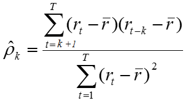

<h1>In this NoteBook:</h1>

- TS analysis.
    - Seasonality Test 
        * Single or Multiple seasonalities.
        * Additive or Multiplicative seasonality.
        * Seasonality with even vs. uneven number of periods.
    - Stationarity Test.
    - Correlation Test. (When dealing with data as Panel data)
- Apply Seasonal Decomposition.
- Build Forecasting models.
- Compare the performance of these models with and without decomposition.

<h2> Steps in details:</h2>

<h3> 1) Time series analysis: </h2> 

- Decomposition: 
<ul>
     
  A useful abstraction for selecting forecasting methods is to break a time series down into systematic and unsystematic components.
  <ul>
  <li><b>Systematic:</b> Components of the time series that have consistency or recurrence and can be described and modeled.
  <li><b>Non-Systematic:</b> Components of the time series that cannot be directly modeled. 
  A given time series is thought to consist of three systematic components including level, trend, seasonality, and one non-systematic component called noise.
  </ul>
  These components are defined as follows:
  <ul>
  <li><b>Trend:</b> The increasing or decreasing value in the series.
  <li><b>Seasonality:</b> The repeating short-term cycle in the series.
  <li><b>Noise:</b> The random variation in the series.
  </ul>
 </ul>

- Stationarity 
<ul>
  Most time-series models assume that the underlying time-series data is **stationary**.  This assumption gives us some nice statistical properties that allows us to use various models for forecasting.

  **Stationarity** is a statistical assumption that a time-series has:
  *   **Constant mean**
  *   **Constant variance**
  *   **Autocovariance does not depend on time**

  More simply put, if we are using past data to predict future data, we should assume that the data will follow the same general trends and patterns as in the past.  This general statement holds for most training data and modeling tasks.
  Sometimes we need to transform the data in order to make it stationary. We can check stationarity using these techniques:

  **Testing the stationarity:**
  - Rolling mean and standard deviation and look if they are changing over time. 
  - Apply Dickey-Fuller test or KPSS test, and see if we can reject the null hypothesis (that the time series is stationary)
  - Dickey-Fuller Test:
      - Null Hypothesis: Time Series is stationary. It gives a time-dependent trend.
      - Alternate Hypothesis: Time Series is non-stationary. In another term, the series doesn’t depend on time.
      - ADF or t Statistic < critical values: Accept the null hypothesis. Time series is stationary.
      - ADF or t Statistic > critical values: Failed to reject the null hypothesis. The time series is non-stationary
  </ul>   
  
- Correlation: 
<ul>
  - **ACF:** A mathematical representation of the degree of similarity between a given time series and the lagged version of itself over successive time intervals. In other words, instead of calculating the correlation between two different series, we calculate the correlation of the series with an “x” unit lagged version (x∈N) of itself. It describes how well the present value of the series is related with its past values.
  </img>  
  <ul>
  <li> r(t) = The time series sorted in ascending order
  <li> r(t-k) = The same time series as above but shifted by K units (in our case k=3)
  <li> r_bar = Average of the original time series</li>
  </ul> 
  - **PACF:** Summarizes the relationship between an observation in a TS with an observations at pevious time steps, but with relationships of the intervening obsrvations are removed.  
  So, ACF measures the accumalated affects past lags have on the current value, while PACF measures the direct affect.  
  - The blue area represents Significance
</ul>

<h3> 1) Time series Forecasting: </h2> 
<ul>
- Statistical methods:
  
  - Common Approaches:
      - Trend, Seasonal, Residual Decompositions:
          - Seasonal Extraction in ARIMA Time Series (SEATS).
          - Seasonal and Trend decomposition using Loess (STL). 
          - Exponential smoothing:
              - Single Exponential Smoothing, or SES, for univariate data without trend or seasonality.
              - Double Exponential Smoothing for univariate data with support for trends.
              - Triple Exponential Smoothing, or Holt-Winters Exponential Smoothing, with support for both trends and seasonality.(TES)
      - Autoregressive Models (AR).
      - Moving Average Models (MA).

  - Box–Jenkins Approaches: 
      - ARIMA.
      - SARIMA.

- Machine Learning Methods
    - KNN.
    - SVR.
    - LR.
    - ElasticNet.
    - Lasso.
    
- Deep Learning Methods:
    - MLP.
    - CNN.
    - LSTM.
  
 </ul>
