

[![A][contributors-shield]][contributors-url1]
[![Contributors][contributors-shield]][contributors-url2]
[![Forks][forks-shield]][forks-url]
[![Stargazers][stars-shield]][stars-url]
[![Issues][issues-shield]][issues-url]
[![LinkedIn][linkedin-shield]][linkedin-url]

[contributors-shield]: https://img.shields.io/github/contributors/github_username/repo_name.svg?style=for-the-badge
[contributors-url1]: https://github.com/abdallah-elsawy
[contributors-url2]: https://github.com/tarekmoha
<!-- [contributors-url3]: https://github.com/abdallah-elsawy -->
[forks-shield]: https://img.shields.io/github/forks/github_username/repo_name.svg?style=for-the-badge
[forks-url]: https://github.com/AlaaSedeeq/Millan-Data-Imputation-And-Forecasting/fork
[stars-shield]: https://img.shields.io/github/stars/github_username/repo_name.svg?style=for-the-badge
[stars-url]: https://github.com/AlaaSedeeq/Millan-Data-Imputation-And-Forecasting/stargazers
[issues-shield]: https://img.shields.io/github/issues/github_username/repo_name.svg?style=for-the-badge
[issues-url]: https://github.com/AlaaSedeeq/Millan-Data-Imputation-And-Forecasting/issues
[license-shield]: https://img.shields.io/github/license/github_username/repo_name.svg?style=for-the-badge
[linkedin-url]: https://linkedin.com/in/alaa-sedeeq
[linkedin-shield]: https://img.shields.io/badge/-LinkedIn-black.svg?style=for-the-badge&logo=linkedin&colorB=555

### Built With

* [Python](https://www.python.org/)
* [TensorFlow](https://www.tensorflow.org/)
* [Keras](https://keras.io/)

(<a href="#top">back to top</a>)

# Table of content:

> Each link contains a file with full description of the work done in
> that file to accomplish its task.
## ReadMe Structure
1. <a href="#for">Introduction</a>.
2. Full Description:
	- <a href="#under">Dataset Understanding</a>
	- Preprocessing:
		- <a href="#exp">Data Cleaning and exploration</a>
		- <a href="#out">Outliers detection</a>
		- <a href="#miss">Missing Data Imputation</a>
	- Forecasting:
		- <a href="#prefor">Pre-forecasting steps</a>
		- <a href="#ffor">Forecasting.</a>
		- Final Results.
3. <a href="#struct">Files Structure.</a>
4. <a href="#ref">References used.</a>
5. <a href="#cont">Contributors.</a>
# Telefonica mobile network forecasting:

In the recent years, mobile network loads has grown exponentially due to
the increasing demand and the variety of the services that can a mobile
network operator can provide, which caused a huge demand for predicting the volume of the traffic, and this is a very challenging task as network traffic faces high nonlinearities and complex patterns, in this project we propose a several models to predict the temporal aspects of the mobile network traffic by dealing with each area as a separated entry, the modelling process provides a wide variety of alternatives throughout the whole modelling form anomaly detection which includes using Tokey’s box, isolation forest and LSTM, and missing data imputations which includes using GAINs and ConvGains and also Seasonal interpolation, and finally the forecasting models which includes using FBProphet model that has a great performance and accuracy and also other statistical methods like STL and SARIMA and finally deep learning methods like CNN.

# Block and description:

## Data Pre processing Stage:

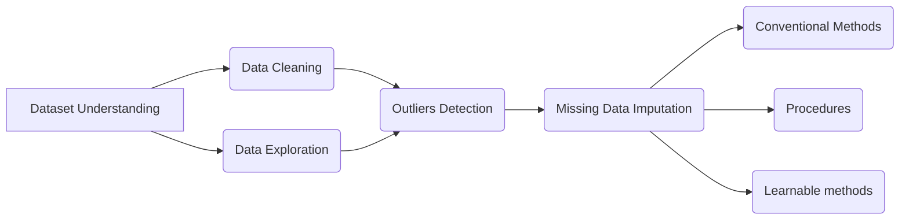
### Dataset and data Understanding: 

The data has been collected over two months, from November 1st, 2013 to January 1st, 2014, this data is a spatio-temporal data that contains temporal measurements taken from a given area, so the spatial distribution irregularity is aggregated in square grids, This allows comparisons between different areas and eases the geographical management of the data[21]. 
The data was taken from Two Italian cities, Milan and Terenteno, the area of milan is divided into 100X100 grid squares and Terenteno is divided into 117`X`98 grid square, as in the following figure, every grid square is 235 `X` 235 meters.[21] 
This data measures the interaction between the humans and the mobile network through measuring the Call Detailed Records (CDRs) over a certain area in a given time interval, and the mechanism of taking these CDRs is as follows: 
A new CDR is generated every time a user engages with the network entity, here is the Radio Base Station (RBS), this created CDR is recording the time of interaction between the user and the RBS.[21]

### Data Exploration and cleaning:

- Excluding roaming data: 
	This dataset is collected from Milan City in Italy which is well known as a good destination for tourists around the world, and also Italy is an European country which means that by default the roaming service is activated.
	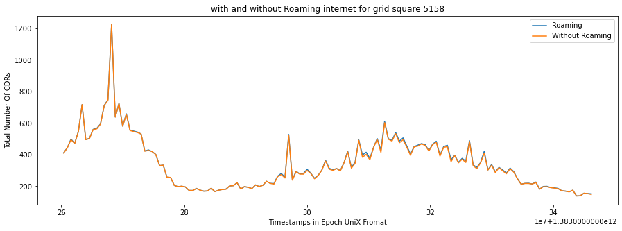
- Excluding other CDRs except the internet ones:
	As we have mentioned in the Data Understanding section this data contains different Call Details record (CDRs), so we have studied their different effects on the overall CDRs to see the contributions and the effect of the CDRs to know whether there was a dominant one that can contribute the most to our analysis.
	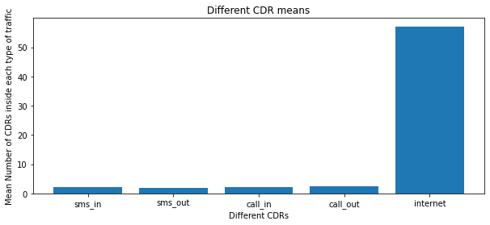
	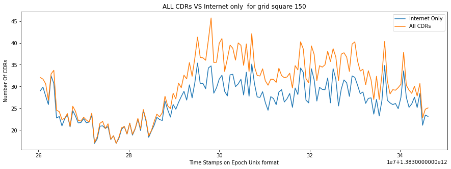
- Resampling the data:
	Any data in the world and be noisy, but this noise in the time series
analysis process is very critical and can make some changes in the end model, so one of the main characteristics in time series data is it has measurement every predefined period, and here our period is 10 minutes so before modelling we have to make sure that at every 10 minutes we have a measurement
- Choosing subsets:
	Due to computational limits, we will not be able to model every single
grid square, so we had to choose some relevant subsets to make the rest of the analysis and modelling on it, we decided to choose 9 grids that had interesting behavior, the interesting behavior we mean is that it has more mean usage than the other grid squares, because these high loaded cells have more probabilities to face problems, and to choose these we have to know where the crowd lies.
	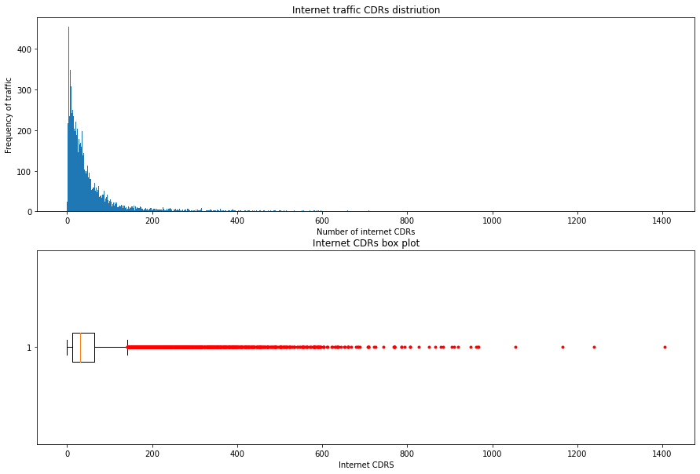
	</img>
<!-- 	 -->
- Check Time Series Characteristics:
	Main characteristics for any time series data is the trend, seasonality and holidays.
	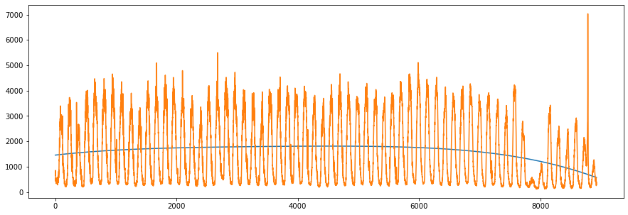
	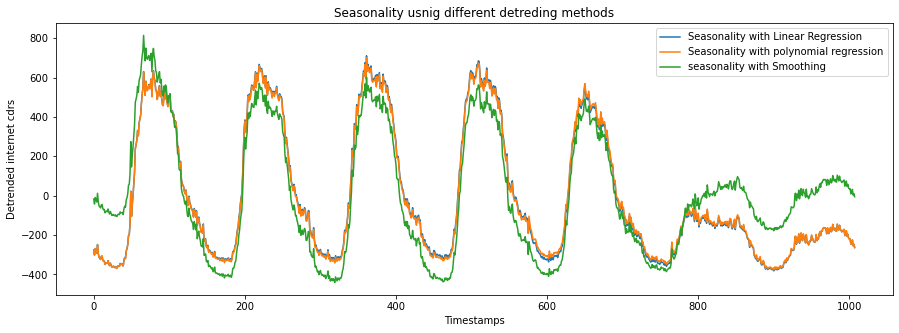
- Excluding the last 10 days: 
	As we can see from figures 8. 11, 14 the last 10 days faces different trend and can be modeled as a separated model as they contain the Christmas and New Year’s holidays then we will exclude them to not biasing results and also we don’t have a yearly data to model them properly.
### Outliers detection:

Anomaly detection is the process of discover the event or the points which are unexpected at this position of the dataset or deviates from the normal pattern of the dataset. 
So, the detection of those points very important; because it give us an early step to make the emergency movements to control that un usual change.
- Tokey's Box Plot:
	in this method we depend on the pox plot to determine if the point is outlier or not and not only that it gives us the ability to decide if this outlier is possible or probable outlier point; by calculate the following parameters: 25th percentile (Q1), 75th percentile (Q3), interquartile range (IQR = Q3 – Q1), Lower inner fence: [Q1 – (1.5 * IQR)] , Upper , inner fence: [Q3 + (1.5 * IQR)], Lower outer fence: [Q1 – (3 * IQR)], Upper outer fence: [Q3 + (3 * IQR)].
	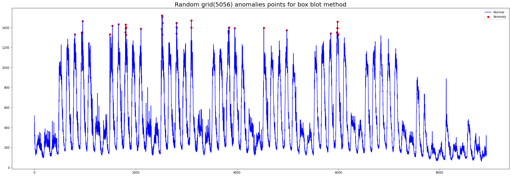
- Isolation Forest Method:
	Isolation Forest build using the decision trees which depend on the points that go deeper into the tree are not anomalies and points which go short distance have big probability to be anomalies, and it is unsupervised learning model which used without labeled data.[24]
	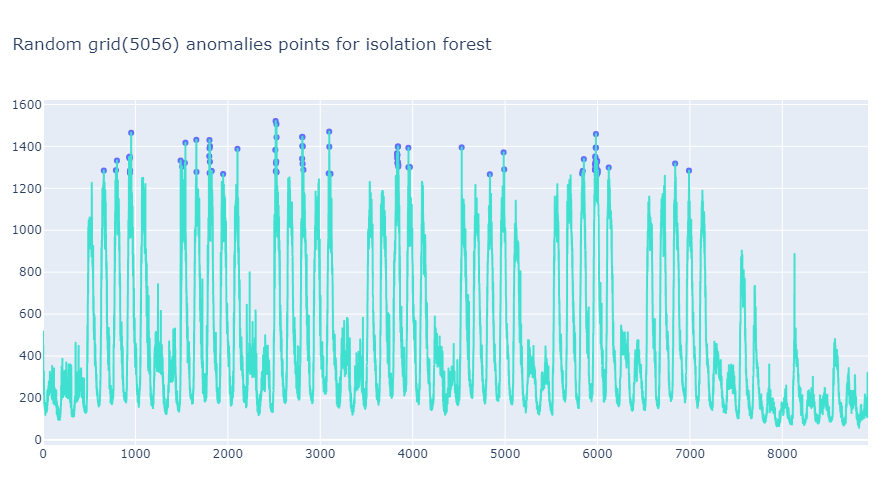
- LSTM Autoencoders Method:
	In this method we will depend on the detection using the forecasting by Deep Learning algorithms. In the forecasting methods we depend on predict the next point with the addition of some noise and make comparison of this point and the true point at this timestamp by finding the difference between the two points then add threshold finally find the anomalies by compare the difference of the two points with this threshold (we used the Mean absolute error MAE).[23]
	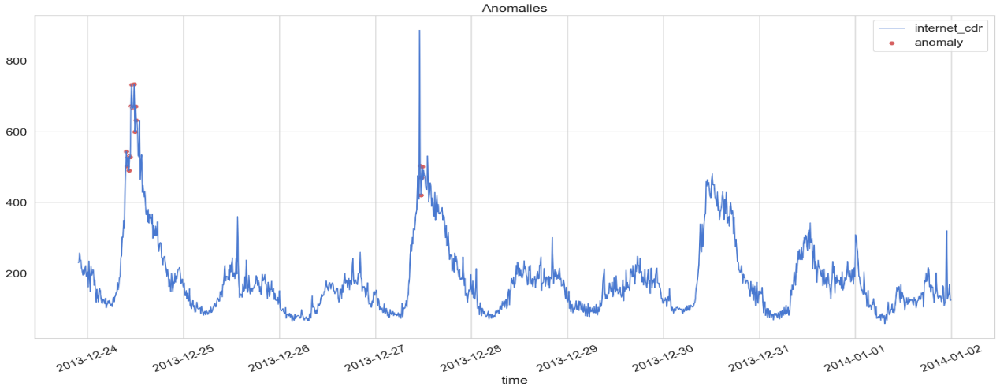
- Seasonal-Trend Decomposition Method:
	Signal decomposition aims to analysis our signal to its main three components Seasonal, trend and the residual (S, T, R). Seasonal is the signal component which contain the most rapidly pattern which occurs regular every certain time. Trend contain the general shape of the data over the whole dataset and finally the residual is the rest of the signal after extract the seasonal and trend of it, it is in somehow a random part over the signal which indicate it.[25]
	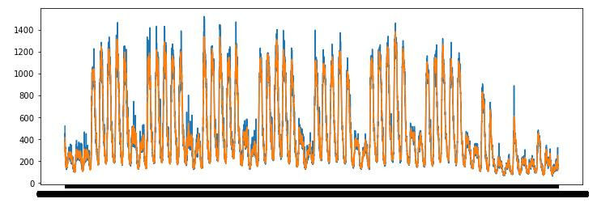
### Missing Data Imputation methods:

It’s important for the time series not to have any missing data to be modeled properly because the time series data has to be equally spaced as the most of the models assume [10]. 
We can assume that our Data is MCAR and there is no dependency In the missing data, and to know the accuracy of all methods we will assume some missing rate and know the accuracy of the method to capture the original value.
- Conventional methods:
	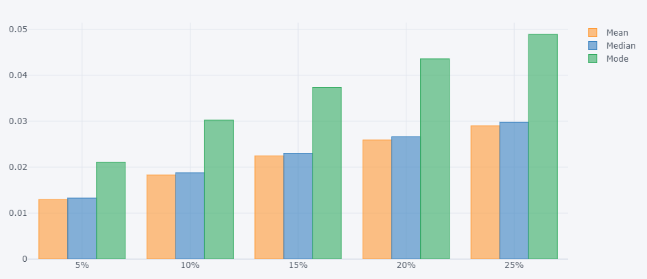
- Procedures:
	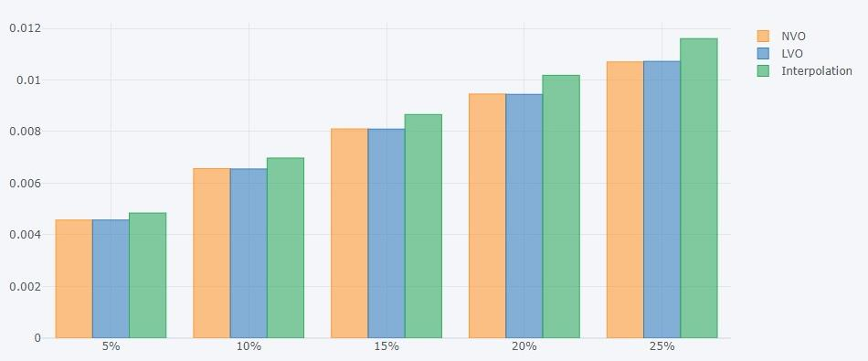
- Learnable methods:
	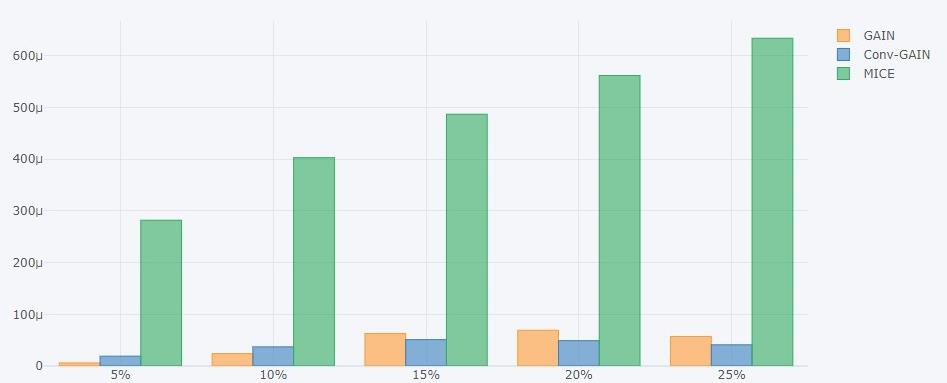
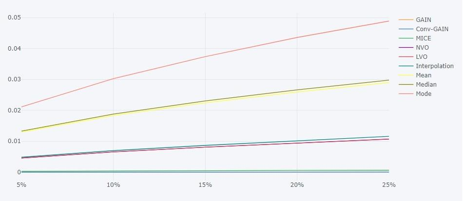
## Forecasting Stage:

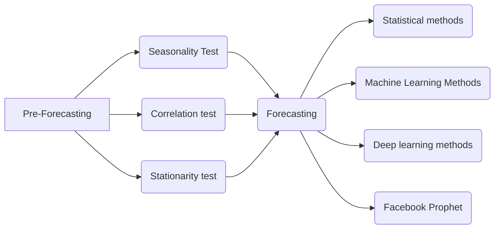
### Pre-Forecasting:

In this step we want to check and test for different characteristics in our data to help us make the right choice of our modeling process, and this step has 3 other steps:
- Seasonality Test:
	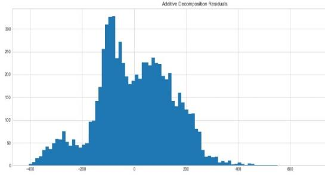
	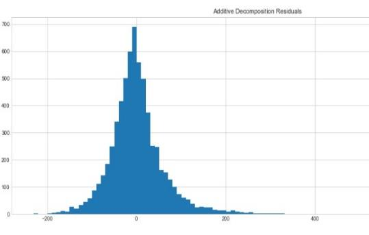
- Correlation test:
	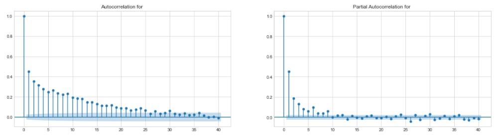
- Stationarity test:
	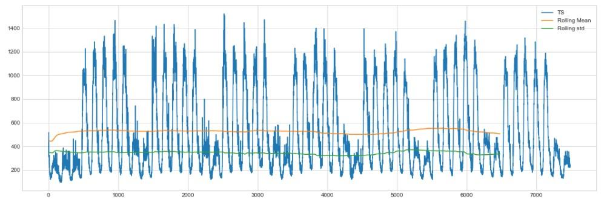
### Forecasting:

We will use the sliding window technique with shifting window with window size of 30 days (4320 steps) and forecasting for 1,2,3,7 Days (144, 288, 432, 1008 steps), and measureing the accuracy of our models by two metrics: Noramalized root mean sqaure error (NRMSE) and Mean absolute percentage error(MAPE), and the models that we have used:
1. Statistical methods: ARIMA, Theta, Exponential Smoothing.
	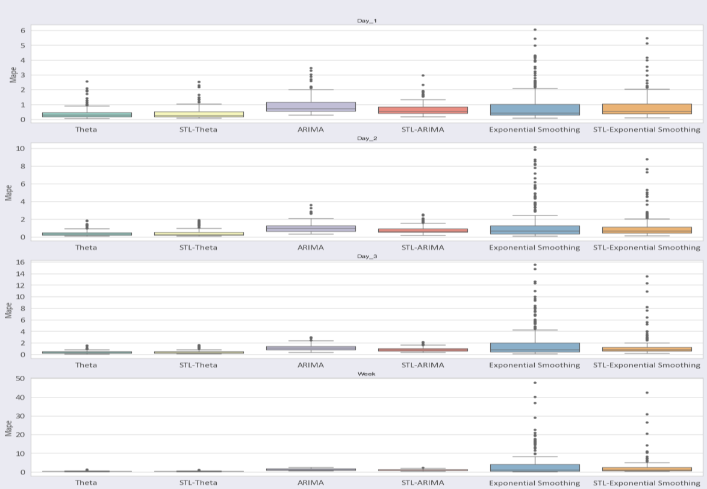
2. Machine Learning Methods: KNN, SVR, LR, ElasticNet, Lasso .
	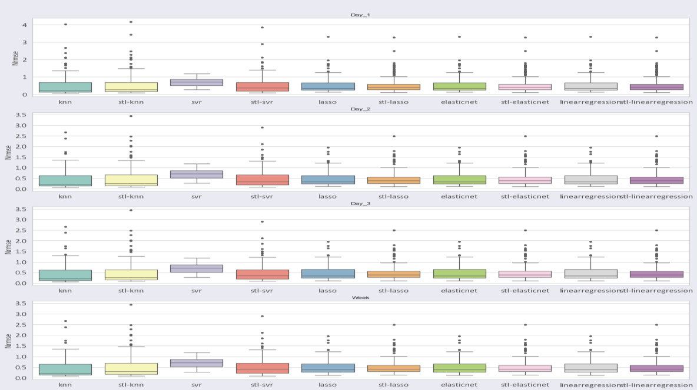
3. Deep learning methods: MLP, CNN, LSTM.
	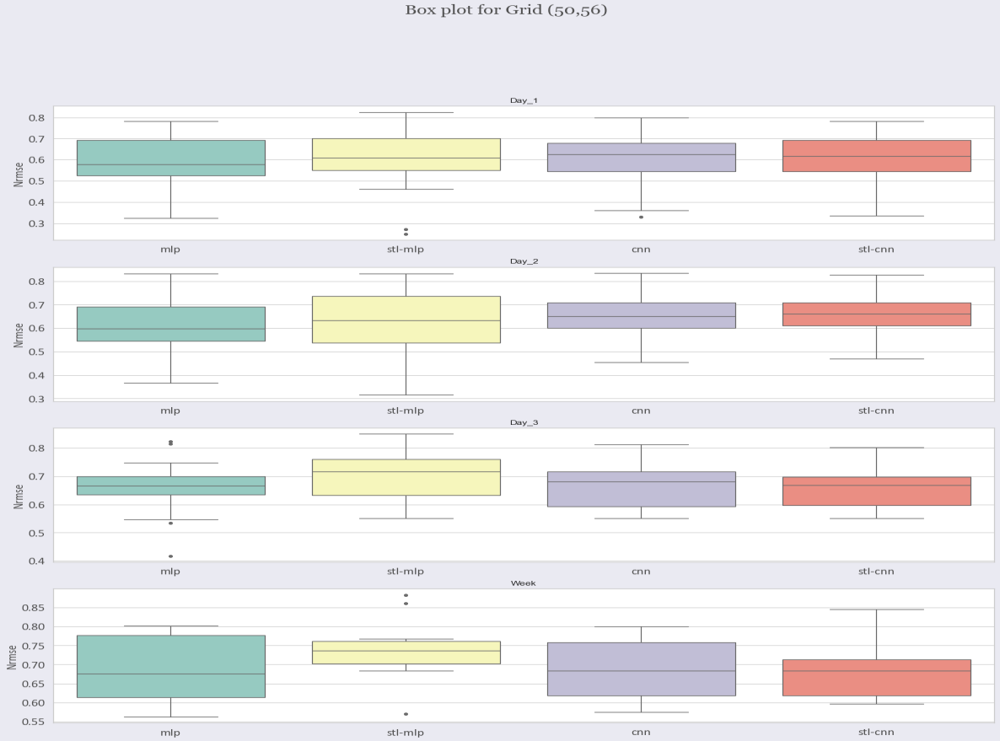
4. Facebook Prophet:
	This model is a forecasting model developed by Facebook and depends on decomposing the time series into its main components Trend, seasonality, holidays effect and random part and by modelling each part individually [13].
	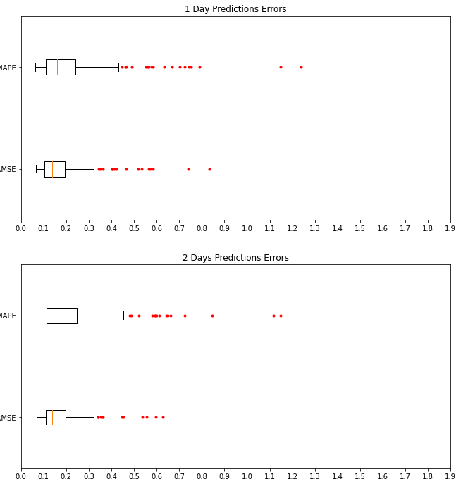
	

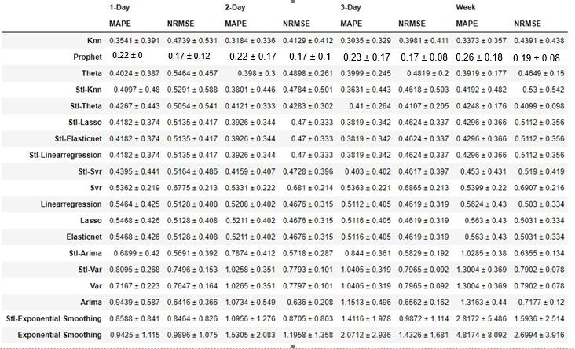

# Files Structure:

 1. [Data set description.](https://github.com/AlaaSedeeq/Millan-Data-Imputation-And-Forecasting/blob/main/Data%20Preprocessing/Understand_data_documented.ipynb)
 2. Data pre-processing.
	 - [Data cleaning](https://github.com/AlaaSedeeq/Millan-Data-Imputation-And-Forecasting/blob/main/Data%20Preprocessing/data_preperation_documented.ipynb).
	 - [Data Exploration](https://github.com/AlaaSedeeq/Millan-Data-Imputation-And-Forecasting/blob/main/Data%20Preprocessing/Exploring_Data_documented.ipynb).
	 - [Outliers Detection](https://github.com/AlaaSedeeq/Millan-Data-Imputation-And-Forecasting/blob/main/Data%20Preprocessing/Time-Series-Anomaly-Detection/Time%20Series%20Anomaly%20Detection%20All%20Work.ipynb).
		 - [Decomposition Method](https://github.com/AlaaSedeeq/Millan-Data-Imputation-And-Forecasting/blob/main/Data%20Preprocessing/Time-Series-Anomaly-Detection/Decomposition%20Method.ipynb).
		 - [Isolation Forest Method](https://github.com/AlaaSedeeq/Millan-Data-Imputation-And-Forecasting/blob/main/Data%20Preprocessing/Time-Series-Anomaly-Detection/Isolation%20Forest%20Method.ipynb).
		 - [LSTM Autoencoders method](https://github.com/AlaaSedeeq/Millan-Data-Imputation-And-Forecasting/blob/main/Data%20Preprocessing/Time-Series-Anomaly-Detection/LSTM%20Autoencoders.ipynb).
		 - [Tokey's Method](https://github.com/AlaaSedeeq/Millan-Data-Imputation-And-Forecasting/blob/main/Data%20Preprocessing/Time-Series-Anomaly-Detection/Tukeys%20Box%20plot%20Method.ipynb).
	 - [Missing Data Imputation](https://github.com/AlaaSedeeq/Millan-Data-Imputation-And-Forecasting/blob/main/Data%20Preprocessing/Data%20preparation%20and%20imputaion/Data%20preparation%20and%20imputaion.ipynb):
		 This File including several missing data imputation methods:
			 
		 - Conventional methods.
		 - Procedures.
		 - GAIN.
		 - ConGAIN
		 - other learnable methods.
		 all descriptions are found inside the file.
 3. Modeling and forecasting.
	 - Statistical Methods.
	 - Machine learning methods.
	 - Deep learning methods.
	 - Facebook prophet model.

# References:

1. J. Huang, J. Tan, Y. Liang, Wireless big data: transforming heterogeneous networks to smart networks. J. Commun. Inf. Netw. 2(1), 19–32 (2017)
2. X. Wu, X. Zhu, G. Wu, Data mining with big data. IEEE Trans. Knowl. Data Eng. 26(1), 97–107 (2014)
3. Y. Lecun, Y. Bengio, G. Hinton, Deep learning. Nature 521(7553), 436 444 (2015)
4. M. Jordan, T. Mitchell, and Machine learning: trends, perspectives, and prospects. Science 349(6245), 255–260 (2015)
5. Ericsson Mobility Report and Data Forecasts, Mobile data traffic outlook (2021)
6. Qingtian Zeng, Qiang Sun, Geng Chen 1, Hua Duan, Attention based multi-component spatiotemporal cross-domain neural network model for wireless cellular network traffic prediction, EURASIP Journal on Advances in Signal Processing 2021:46 (2021)
7. Markus Löning, Anthony Bagnall, Sajaysurya Ganesh, Viktor Kazakov, Jason Lines, Franz J. Király, sktime: A Unified Interface for Machine Learning with Time Series.
8. Dr. N.D Lewis, DEEP TIME SERIES FORECASTING With PYTHON: An Intuitive Introduction to Deep Learning for Applied Time Series Modeling.
9. Jason Brownlee, Introduction to Time Series Forecasting with Python: How to Prepare Data and Develop Models to Predict the Future
10. Jinsung Yoon, James Jordon, Mihaela van der Schaar, GAIN: Missing Data Imputation using Generative Adversarial Nets.
11. Ehsan Adeli, Jize Zhang, Alexandros , A. Taflanidis, Convolutional generative adversarial imputation networks for spatio-temporal missing data in storm surge simulations.
12. Irfan Pratama1, Adhistya Erna Permanasari, Igi Ardiyanto, Rini Indrayani, A Review of Missing Values Handling Methods on Time-Series Data.
13. Barlacchi, G., De Nadai, M., Larcher, R. et al. A multi-source dataset of urban life in the city of Milan and the Province of Trentino. Sci Data 2, 150055 (2015). https://doi.org/10.1038/sdata.2015.55.
14. R. J. A. Little and D. B. Rubin, Statistical Analysis with Missing Data, 2nd Ed., Hoboken, NJ: Wiley, 2002.15. H. Demirhan, Z. Renwick, Missing value imputation for short to mid-term horizontal solar irradiance data. Appl Energy, vol. 225, pp. 998–1012, (2018). 10.1016/j.apenergy.2018.05.054.
16. Shin-Fu Wu, Chia-Yung Chang, and Shie-Jue Lee, Time Series Forecasting with Missing Values
17. Jinsung Yoon, James Jordon, Mihaela van der Schaar, GAIN: Missing Data Imputation using Generative Adversarial Nets.
18. Ehsan Adeli, Jize Zhang, Alexandros , A. Taflanidis, Convolutional generative adversarial imputation networks for spatio-temporal missing data in storm surge simulations.
19. Irfan Pratama1, Adhistya Erna Permanasari, Igi Ardiyanto, Rini Indrayani, A Review of Missing Values Handling Methods on Time-Series Data.
20. Stef van Buuren TNO Karin Groothuis-Oudshoorn, MICE: Multivariate Imputation by Chained Equations.
22. Time-Series Anomaly Detection Service at Microsoft Hansheng Ren, Bixiong Xu, Yujing Wang, Chao Yi, Congrui Huang, Xiaoyu Kou∗ Tony Xing, Mao Yang, Jie Tong, Qi Zhang Microsoft Beijing, China.
23. Iglewicz B, Hoaglin DC (1993) How to detect and handle outliers. ASQC Quality Press.
24. Raghavendra Chalapathy and Sanjay Chawla. 2019. Deep learning for
anomaly detection: A survey. arXiv preprint arXiv:1901.03407 (2019).
25. https://blogs.sap.com/2020/12/21/anomaly-detection-in-time-series-using-seasonal-decomposition-in-python-machine-learning-client-for-sap-hana/
26. https://towardsdatascience.com/detecting-and-treating-outliers-in-python-part-1-4ece5098b755
27. Chaoyun Zhang, Paul Patras, Long-Term Mobile Traffic Forecasting Using Deep Spatio-Temporal Neural Networks.
28. Sean J. Taylor , Benjamin Letham, Forecasting at Scale.
29. Hansheng Ren, Bixiong Xu, Yujing Wang, Chao Yi, Congrui Huang, Xiaoyu Kou, Tony Xing, Mao Yang, Jie Tong, Qi Zhang, Time-Series Anomaly Detection Service at Microsoft.
# Contributors:

- [Alaa Sedeeq](https://github.com/AlaaSedeeq/)
- [Abdullah Elsawy](https://github.com/abdallah-elsawy)
- [Ibrahim Sayed](https://github.com/IbrahimSayedMohammed)
- [Tarek Mohamed](https://github.com/tarekmoha)

